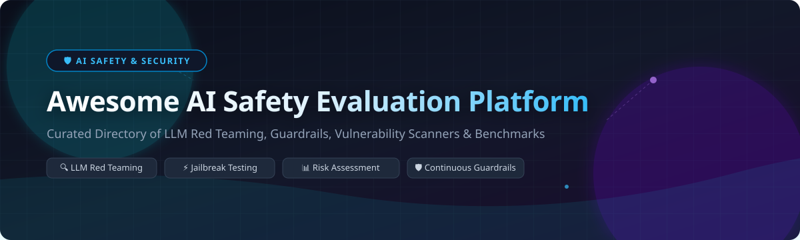

# 🛡️ Awesome AI Safety Evaluation Platform

  
  
  

---

## 📌 Top AI Safety & LLM Evaluation Platform Ecosystem

**Curated List of SaaS Products & Open-Source GitHub Projects**  
*Focused on LLM Red Teaming, AI Safety Benchmarks, Jailbreak Evaluation, Guardrail Testing, Model Risk Assessment & Continuous AI Safety Scoring.*

**Last updated: September 2026**

This repository tracks notable **SaaS platforms** and **open-source projects** for **AI Safety Evaluation**. These systems systematically test models and applications for prompt injection, jailbreaks, toxic or biased outputs, policy violations, and other safety failures—supporting pre-deployment gates, regression testing, and ongoing risk scoring.

---

## 📑 Table of Contents

- [🏢 SaaS & Hosted Platforms](#-saas--hosted-platforms)
- [🔓 Open-Source GitHub Projects](#-open-source-github-projects)
- [🛠️ How to Contribute](#️-how-to-contribute)
- [⚠️ Disclaimer](#️-disclaimer)
- [💖 Support](#-support)
- [📈 Star History](#-star-history)

---

## 🏢 SaaS & Hosted Platforms

> 💡 **Market Insights**: The global AI Safety & LLM Evaluation market size is estimated at **$2.4 Billion (2026)** and projected to reach **$16.8 Billion by 2030**. The sector is currently **moderately fragmented** with high consolidation velocity as enterprise cybersecurity majors acquire emerging safety platforms.

Below is a curated table of leading enterprise SaaS platforms for AI safety evaluation, red teaming, and runtime guardrails, sorted by **Company Size & Valuation (Descending)**:

| 🏢 Platform / Vendor | 💰 Starting Pricing | 🎁 Free Tier / Trial Limit | 📊 Company Size & Valuation | 📌 Primary Safety Focus |
| :--- | :--- | :--- | :--- | :--- |
| **[NVIDIA AI Enterprise / NeMo](https://www.nvidia.com/)** | $4,500 / GPU / year | 90-Day Free Trial (Full Platform Access) | **~$3.2 Trillion** (Public Enterprise) | Enterprise AI Guardrails, Adversarial Robustness & Safety Controls |
| **[Protect AI (Palo Alto Networks)](https://protectai.com/)** | $108,000 / year (Prisma AIRS) | 30-Day Enterprise Trial (Up to 100 Scans) | **Acquired for $700M** (Palo Alto Networks: $110B+ Cap) | Automated AI Red Teaming, Vulnerability Scans & Model Armor |
| **[Patronus AI](https://www.patronus.ai/)** | $25 / month (Base Plan) | Free Developer Tier ($10 credits, 1k calls, 14-day history) | **~$445 Million** (Series B, $50M+ Raised) | Hallucination Detection, Safety Scoring & Automated Evaluation |
| **[HiddenLayer](https://www.hiddenlayer.com/)** | $130 / resource / month | 30-Day Free Trial (5 Resources included) | **~$380M - $500M+** ($100M Series B in 2026) | AI Runtime Threat Detection, ML SecOps & Vulnerability Scanning |
| **[Robust Intelligence (Cisco)](https://robustintelligence.com/)** | $15,000 / year (Cisco AI Defense) | 14-Day Sandbox Trial (Up to 500 test runs) | **Acquired by Cisco** (~$350M–$400M Deal) | AI Stress Testing, Automated Model Auditing & Continuous Red Teaming |
| **[Lakera Guard](https://www.lakera.ai/)** | $99 / month (Pro Tier) | Free Community Tier (Up to 10k API calls / mo) | **Acquired for $300M** (Check Point Software) | Real-Time Prompt Injection Defense & AI Safety Vulnerability Testing |
| **[CalypsoAI](https://calypsoai.com/)** | $50,000 / year (Enterprise Pack) | 14-Day Enterprise Trial (Up to 5 Models Monitored) | **Acquired for $180M** (F5 Networks) | LLM Scanner, Governance, Red Teaming & Policy Validation |
| **[Arthur AI](https://www.arthur.ai/)** | $60 / month (Premium Tier) | Free Forever Tier (Up to 4 use cases, 10k queries/mo) | **~$150M - $250M** ($60M Total Funding) | AI Governance, Hallucination Checks & Safety Observability |
| **[Fiddler AI](https://www.fiddler.ai/)** | $500 / month (Developer Tier) | 30-Day Free Trial (AWS SageMaker, up to 5 models) | **~$120 Million** ($30M Series C) | LLM Observability, Model Drift & Safety Metrics |
| **[Virtue AI (Fortinet)](https://virtue.ai/)** | $20,000 / year (Fortinet Module) | 30-Day Trial (Up to 3 Red Teaming campaigns) | **Acquired by Fortinet** (~$100M Deal, $30M VC) | Autonomous Agent Safety, Validation & Guardrail Audits |
| **[Aporia](https://www.aporia.com/)** | $0 / year (Starter Tier) | Free Starter Plan ($0/yr, 1 model, 25k events/mo) | **Acquired by Coralogix** (~$50M Deal) | Real-time Guardrails, AI Toxicity & Hallucination Mitigation |
| **[Invariant Labs (Snyk)](https://invariantlabs.ai/)** | $25 / user / month (Snyk Suite) | Free Developer Tier (Up to 200 security tests/mo) | **Acquired by Snyk** (~$40M Deal) | Agentic AI Safety, Logic Invariant Audits & Vulnerability Scoring |

---

## 🔓 Open-Source GitHub Projects

The open-source AI safety ecosystem features battle-tested tools for automated red teaming, benchmark harness evaluation, and real-time safety guardrails.

Below is the list of top open-source projects, sorted by **GitHub Stars_Count (Descending)**. Each Stars_Badge links directly to the stargazers page of the repository:

1. 🥇 **[promptfoo/promptfoo](https://github.com/promptfoo/promptfoo)**  
     
   *CLI and library for evaluating LLM outputs, red teaming, jailbreak testing, and CI/CD security gating.*

2. 🥈 **[guidance-ai/guidance](https://github.com/guidance-ai/guidance)**  
     
   *Guidance language for controlling LLM generation, enforcing structured outputs, and preventing unwanted behavior.*

3. 🥉 **[openai/evals](https://github.com/openai/evals)**  
     
   *OpenAI's official framework for evaluating LLMs and safety behaviors across standard benchmark suites.*

4. 🏅 **[confident-ai/deepeval](https://github.com/confident-ai/deepeval)**  
     
   *The open-source LLM evaluation framework for measuring hallucination, toxicity, bias, and RAG safety metrics.*

5. 🏅 **[explodinggradients/ragas](https://github.com/explodinggradients/ragas)**  
     
   *Framework for evaluating Retrieval Augmented Generation (RAG) pipelines for safety, context recall, and truthfulness.*

6. 🏅 **[EleutherAI/lm-evaluation-harness](https://github.com/EleutherAI/lm-evaluation-harness)**  
     
   *Standardized benchmark harness for zero-shot and few-shot language model evaluations across 200+ safety & capability tasks.*

7. 🏅 **[NVIDIA/garak](https://github.com/NVIDIA/garak)**  
     
   *NVIDIA's LLM vulnerability scanner—probes models for jailbreaks, prompt injection, data leakage, and toxic outputs.*

8. 🏅 **[guardrails-ai/guardrails](https://github.com/guardrails-ai/guardrails)**  
     
   *Adding structure, type validation, and real-time safety guardrails to LLM applications.*

9. 🏅 **[NVIDIA/NeMo-Guardrails](https://github.com/NVIDIA/NeMo-Guardrails)**  
     
   *Programmable toolkit for adding conversational guardrails, topic control, and safety policies to LLM applications.*

10. 🏅 **[microsoft/PyRIT](https://github.com/microsoft/PyRIT)**  
      
    *Python Risk Identification Tool for Generative AI—Microsoft's open-source red-teaming framework for AI security.*

11. 🏅 **[meta-llama/PurpleLlama](https://github.com/meta-llama/PurpleLlama)**  
      
    *Meta's cybersecurity evaluation tools, including Llama Guard and CyberSecEval for model trust and safety.*

12. 🏅 **[protectai/llm-guard](https://github.com/protectai/llm-guard)**  
      
    *Security toolkit for LLM inputs and outputs, detecting prompt injections, PII leakage, and toxic content.*

13. 🏅 **[stanford-crfm/helm](https://github.com/stanford-crfm/helm)**  
      
    *Holistic Evaluation of Language Models (HELM) by Stanford CRFM for multi-metric capability and safety assessment.*

14. 🏅 **[UKGovernmentBEIS/inspect_ai](https://github.com/UKGovernmentBEIS/inspect_ai)**  
      
    *Inspect AI evaluation framework developed for large-scale safety research and AI safety institute evaluations.*

15. 🏅 **[microsoft/promptbench](https://github.com/microsoft/promptbench)**  
      
    *Unified library for evaluating LLM robustness against prompt perturbations, adversarial attacks, and dynamic benchmarks.*

---

## 🛠️ How to Contribute

Contributions are warmly welcome! Please follow these simple steps:

1. 🔀 **Fork** the repository.
2. 📝 **Add/Edit** entries in `README.md` following the standard markdown structure.
3. 🔍 Ensure descriptions are factual, link directly to official project/vendor sites, and include correct star links or pricing data.
4. 🚀 **Submit a Pull Request** with a brief summary of additions!

Check out [Awesome-Awesome-Awesome](https://github.com/ishandutta2007/Awesome-Awesome-Awesome) for more curated lists.

---

## ⚠️ Disclaimer

- This is a **community-curated** list — not exhaustive and not an endorsement.
- Safety evaluation is necessary but not sufficient. Passing a test suite does not guarantee absolute safety in production deployments.
- Open-source tools provide transparency and CI/CD integration, while commercial platforms offer continuous threat intelligence and enterprise dashboarding.

---

## 💖 Support

If you find this repository helpful, please consider:
- ⭐ **Starring** this repository to increase visibility!
- 🔀 **Forking** it to customize your own evaluation pipeline.
- 📢 **Sharing** it with AI safety researchers, red-teamers, and platform engineers.
- ☕ **Sponsoring / Buying a Coffee**: Support continuous research and project updates via the [GitHub Sponsors Dashboard](https://github.com/sponsors/ishandutta2007).

---

## 📈 Star History

